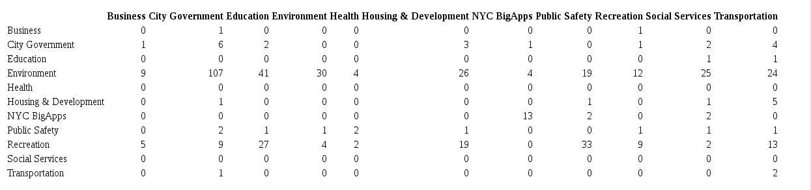

## Analysis of NYC Open meta data

- Look at NYC Open data metadata
- Explore using a foriegn data API programmatically 
- Explore the dataset graphically using embedded live interactive html-based web graphics created in R
- Analyze the dataset using linear regression
- Analyze the dataset using "machine learning/data science" tools, specifically we'll use quadadic discrimimant analysis and evaulaute our model using out of sample predictive power
- Main goals: introduce core topics in the data science curriculum of Metis and see how the concepts taught in the curriculum can be applied to a real-world problem.
- Linear regression is part of the Statistical Foundations course; sets the stage for further study in classification and predictive performance


```{r global_options, include=FALSE}
knitr::opts_chunk$set(warning=FALSE, message=FALSE, fig.align='center')
```
## Get the Data

- Accessing data via an API programmatically
- Working with with foreign API
- Working with JSON objects within R

## R Code
```{r}
update_data <- function() {
# get list of datasets available 
dlist <- RSocrata::ls.socrata("https://nycopendata.socrata.com/")

# create empty data frame to store data
ddf <- data.frame(name=character(),
                 attribution=character(),
                 downloadcount=numeric(),
                 viewcount=numeric(), 
                 category=character(),
                 createdAt=numeric(),
                 indexUpdatedAt=numeric(),
                 description=character(),
                 stringsAsFactors=FALSE
                 )

# loop over list of datasets and extract data
for(i in 1:dim(dlist)[1]){
  # get name of json file
  fn <- paste(dlist[i,9],".json",sep="")

  # get json file
  dd <- jsonlite::fromJSON(txt=fn)

  # extract data to be analyzed
  ddf[i,1] <- ifelse(is.null(dd$name),NA,dd$name)
  ddf[i,2] <- ifelse(is.null(dd$attribution),NA,dd$attribution)
  ddf[i,3] <- ifelse(is.null(dd$downloadCount),NA,dd$downloadCount)
  ddf[i,4] <- ifelse(is.null(dd$viewCount),NA,dd$viewCount)
  ddf[i,5] <- ifelse(is.null(dd$category),NA,dd$category)
  ddf[i,6] <- ifelse(is.null(dd$createdAt),NA,dd$createdAt)
  ddf[i,7] <- ifelse(is.null(dd$indexUpdatedAt),NA,dd$indexUpdatedAt)
  ddf[i,8] <- ifelse(is.null(dd$description),NA,dd$description)
}
return(ddf)
}
```

## Visual Data Exploration

```{r, echo=FALSE, fig.align='center'}
library(ggplot2)
library(plotly)

pd <- dat[complete.cases(dat),]

p <- ggplot2::ggplot(data=pd,aes(x=viewcount,y=downloadcount)) + geom_point(aes(colour = category))
p <- p + geom_abline(intercept = 0, slope = 1)
ggplotly(p)
```

## Small Multiples: Individual Category Plots

```{r, echo=FALSE}
pd <- dat[complete.cases(dat),]

ll <- unique(pd$category)

for (i in 1:length(ll)) {
    out <- pd[pd$category==ll[i],]
    p <- ggplot(data=out,aes(x=viewcount,y=downloadcount)) + geom_point(aes(colour = category)) + geom_abline(intercept = 0, slope = 1) + theme(legend.position="none")
    assign(paste("p",i,sep=""),p)
}

subplot(p1,p2,p3,p4,p5,p6,p7,p8,p9,p10,p11,nrows=3)
```

## Bar Plot of Differences

```{r, echo=FALSE}
dc <- aggregate(dat$downloadcount,by=list(dat$category),FUN=sum,na.rm=T)
vc <- aggregate(dat$viewcount,by=list(dat$category),FUN=sum,na.rm=T)
bcd <- cbind(dc,vc[,2],dc[,2]-vc[,2])
colnames(bcd) <- c("Category","download","view","difference")

p <- ggplot(bcd, aes(x=Category, y=difference)) + geom_bar(stat = "identity", aes(fill = Category), legend=FALSE) + theme(axis.title.x=element_blank(),
        axis.text.x=element_blank(),
        axis.ticks.x=element_blank())
ggplotly(p)
```

## Dotplot of Differences

```{r, echo=FALSE}
ddv <- dat$downloadcount - dat$viewcount

ll <- unique(dat$category)

out <- NULL
labs <- NULL
for (i in 1:length(ll)) {
    out <- c(out,ddv[which(dat$category==ll[i])])
    labs <- c(labs,dat$category[which(dat$category==ll[i])])
}

xseq <- 1:length(out)

pd <- data.frame(xseq,out,labs)
colnames(pd) <- c("Dataset","Difference","Category")
p <- ggplot(data=pd,aes(x=Dataset,y=Difference)) + geom_point(aes(colour = Category))
ggplotly(p)
```

## Linear Regression Analysis

We can test these ideas formally with a regression model.  But fitting the category name as a factor-level covariate we can identify categories of datasets that are statistically relevant and also whether they have a statistically higher download count or view count. 

## Transform our response

Compute the ratio of downloads to views as:

```{r}
rdv <- dat[,3]/dat[,4]
```

## Histogram of our response

```{r, echo=FALSE}
p <- ggplot(dat, aes(x=rdv)) + geom_histogram(binwidth=.5, colour="black", fill="white")
ggplotly(p)
```

## Log transformation

```{r, echo=FALSE}
p <- ggplot(dat, aes(x=log(rdv))) + geom_histogram(binwidth=.5, colour="black", fill="white")
ggplotly(p)
```

## Fitting and Interpreting the Linear Model

```{r}
lm.fit <- lm(log(rdv+.001)~dat$category-1)
(summary(lm.fit))
```

## Classification via Quadradic Discriminant Analysis

We can, in a sense, "invert" our problem.  Instead of treating the download and view counts as a random response, and analyzing how they vary as a function of Category, we can ask, given those counts, how well can we classify the Category of a dataset. 

We'll evaluate the performance of our classifier by out-of-sample predictive performance.  

## Split the Dataset into Training and Testing Subsamples

```{r}
# add age to dataset
age <- as.numeric(difftime(Sys.Date(),as.Date(as.POSIXct(dat[,6], origin="1970-01-01")),units="days"))
dat <- cbind(dat,age)

train <- rbinom(dim(dat)[1],1,.70)
mean(train)
test <- dat[!(as.logical(train)),]
```

## Fit the QDA to the Training subset

```{r}
qda.fit <- MASS::qda(category~downloadcount+viewcount+age,data=dat,subset=as.logical(train))
```

## Predict onto the Test subset

```{r}
qda.pred <- predict(qda.fit,test)
qda.class <- qda.pred$class
```

## Results: Confusion Matrix

```{r,echo=FALSE}
cm <- table(qda.pred$class,test$category)
```



## Results: Predictive Performance

```{r}
(mean(qda.class==test$category,na.rm=TRUE))
(prec <- diag(cm)/rowSums(cm))
(recall <- diag(cm)/colSums(cm))
```

